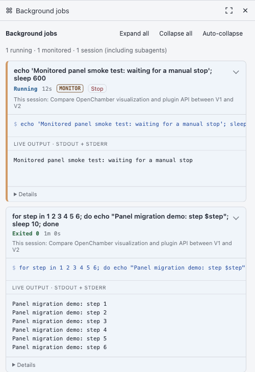

# opencode-monitor

An OpenCode V2 plugin for getting progress updates from a command that keeps running in the background, comparable to [Claude Code's Monitor tool](https://code.claude.com/docs/en/whats-new/2026-w15). Start a build, test run, deployment, or log watch, then keep talking with the agent. As the command prints new lines, the agent hears about them without polling or waiting for the process to finish.

## Install

Install it globally with OpenCode's plugin manager:

```sh
opencode plugin add github:rndmcnlly/opencode-monitor#main
```

Or add it to a project's `opencode.jsonc`:

```jsonc
{
  "$schema": "https://opencode.ai/config.json",
  "plugins": ["github:rndmcnlly/opencode-monitor#main"]
}
```

Then ask the agent to run a command with `background: true` and `monitor: true`, for example:

```ts
shell({ command: "tail -f app.log | grep --line-buffered ERROR", background: true, monitor: true })
```

Each line of output becomes an update in the conversation. Filter noisy commands so the updates stay useful. OpenCode still notifies the session when the command finishes.

## OpenChamber background-jobs panel

The optional [OpenChamber extension](./openchamber-extension/README.md) brings back Perk's job cards for V2. It shows background shell jobs in the current session and its recursive subagent sessions, including jobs without `monitor: true`. Monitored jobs have an amber edge and **MONITOR** badge, so long-lived watches are easy to find and stop.

Cards show status, elapsed time, owning session, combined live output, and a Cancel job button that remains accessible on collapsed cards. Completed jobs are recovered from session history when the panel opens. Collapse preferences are saved per session; auto-collapse leaves monitored jobs expanded.

Cancelling from the panel explicitly tells the agent that a human cancelled the job, with an instruction not to restart it automatically. For subagent jobs, both the owning session and the session whose panel you used receive the notice. The card retains **Cancelled by human** using that recorded provenance.

<a href="./demo/openchamber-background-jobs.png"></a>

*Example jobs in the optional OpenChamber panel. Representative of the experience; the latest version may look different.*

From this checkout, ask an agent inside OpenChamber to run:

```sh
npm --prefix openchamber-extension install
npm run build:extension
npm run connect:openchamber
```

Then add `openchamber-extension/` in **Settings → Extensions** and allow its local service. See the [extension README](./openchamber-extension/README.md) for connection and lifecycle details.

The extension is entirely optional. The OpenCode plugin has no OpenChamber imports, runtime dependency, or connection requirement. Root `npm install`, `npm run check`, and `npm test` develop and verify only the standalone plugin. The extension has its own dependencies, lockfile, checks, and tests under `openchamber-extension/`.

## Historical context

This plugin carries forward the incremental updates from [opencode-perk](https://github.com/rndmcnlly/opencode-perk), which also provided background jobs for OpenCode V1. V2 has background jobs built in, so monitor focuses on updates *while* a job runs. The broader idea of an assistant responding to live events also grew out of Ivan Martinez-Arias's AI/HCI thesis, [*Integrated Player Assistance with Live Coaches*](https://escholarship.org/uc/item/2pb8x2jg), where assistants receive game context in real time rather than waiting for a player to describe it. Claude Code's Monitor tool is a related, independently developed approach.
